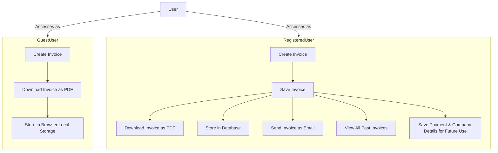

---

# Invoicen

**Invoicen** is an open-source, self-hostable web application designed to simplify invoice generation for freelancers and small businesses. With Invoicen, you can create, manage, and share professional invoices effortlessly. Built with the open-source community and designed to simplify invoice management.

---

## Features

- **Invoice Generation**: Create invoices with customizable logos and designs.
- **PDF Downloads**: Download invoices as PDFs or share them via a self-hosted URL.
- **Email Integration**: Send invoices directly through email.
- **Dashboard**: View and manage Invoice History, Payment History, and Client Data (with CSV upload support).
- **Payment Integration**: Seamlessly connect with Razorpay, Stripe, or other gateways. Enable wallet features for clients.
- **Automated Reminders**: Notify clients about recurring invoices and overdue payments.

---

## System Overview



### Guest Users

- Create invoices without signing up.
- Download invoices as PDFs.
- Invoices are temporarily stored in the browser's local storage.

### Registered Users

- Save invoices securely in the database.
- Download and email invoices.
- Access and manage past invoices via the dashboard.
- Save company and payment details for future use.
- Upload custom logos for branding.

---

## Types of Invoices

1. **Time-Based Invoice**
   - Bill clients based on hours worked.
   - Add multiple time entries and calculate totals using an hourly rate.

2. **Product-Based Invoice**
   - Charge clients for products or services provided.
   - Add multiple items and calculate totals based on unit prices.

---

## Tech Stack

- [Next.js](https://nextjs.org/): A React-based framework for server-rendered applications.
- [Tailwind CSS](https://tailwindcss.com/): A utility-first CSS framework.
- [Shadcn](https://shadcn.com/): UI components built on Tailwind CSS.
- [PostgreSQL](https://www.postgresql.org/): A robust relational database system.

---

## Getting Started

### Installation

1. Clone the repository:
   ```bash
   git clone https://github.com/keizerworks/invoicen.git
   ```

2. Install dependencies:
   ```bash
   npm install
   ```

3. Set up environment variables:
   Create a `.env` file and configure your database and email service.

4. Run the development server:
   ```bash
   npm run dev
   ```

5. Access the app at `http://localhost:3000`.

---

## Contributing

All code contributions, including those from committers, must go through a pull request and be approved by a core developer. This ensures proper review and code quality.

We ❤️ pull requests! Check out our [Contributing guide](CONTRIBUTING.md) to learn how you can help.

---

## License

Invoicen is licensed under: [MIT](https://opensource.org/licenses/MIT)

---

Start creating professional invoices today with **Invoicen**!
