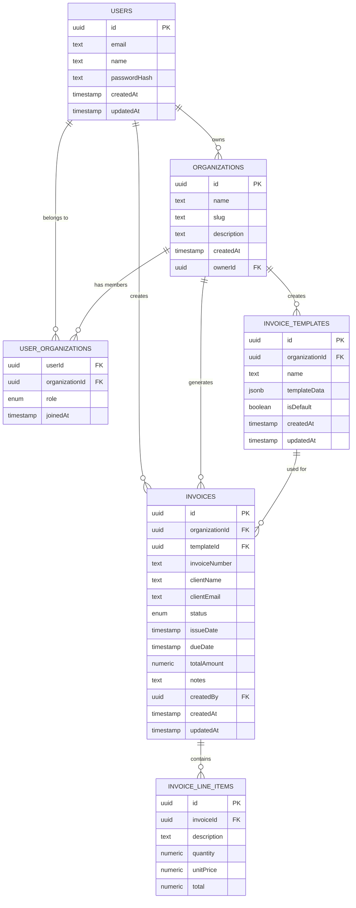

Invoicen uses a PostgreSQL database to store data. The database schema is designed to be simple, efficient, and scalable.
This page provides an overview of the database schema used in Invoicen.

## ER Diagram

Let me break down the key aspects of this schema:

1. Multi-Tenancy Model:
  - `users` table contains core user information
  - `organizations` represents different accounts/apps
  - `userOrganizations` is a junction table that allows users to be part of multiple organizations with different roles

2. Role-Based Access Control:
  - `userRoleEnum` defines roles: owner, admin, editor, viewer
  - Users can have different roles in different organizations

3. Invoice Management:
  - `invoiceTemplates` allows custom templates per organization
  - `invoices` table tracks invoice details
  - `invoiceLineItems` for granular line item tracking

4. Flexible Design:
  - UUID primary keys for scalability
  - Timestamp tracking for audit purposes
  - JSON support for template data (for your Figma-like template editor)

5. Enum Support:
  - `userRoleEnum` for consistent role management
  - `invoiceStatusEnum` for standardized invoice statuses

## Key Features:
- A user can belong to multiple organizations
- Role-based permissions per organization
- Template management with JSON storage
- Comprehensive invoice tracking

## Recommendations:
- Use Drizzle ORM for type-safe database interactions
- Consider adding indexes for performance
- Implement access control logic in your application layer based on roles

---

Mermaid code for the ER Diagram:

